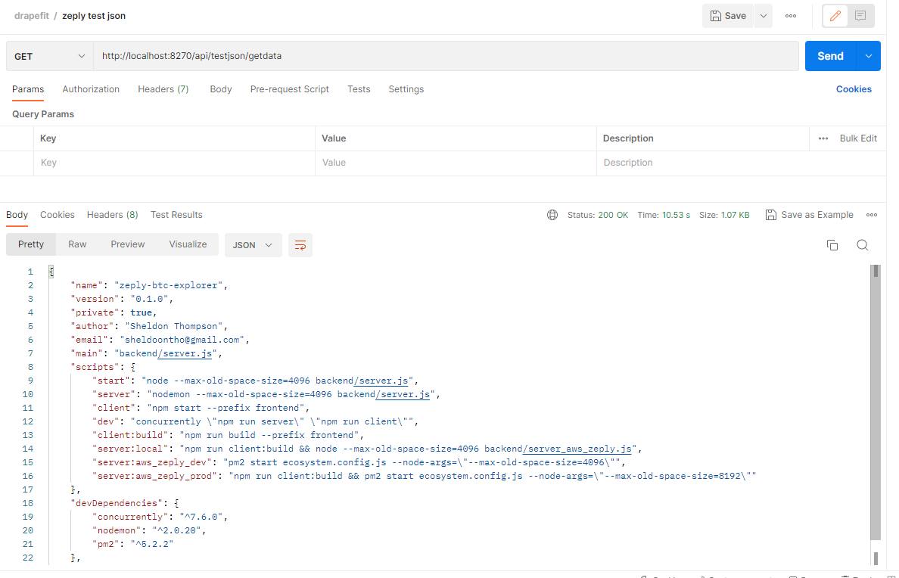
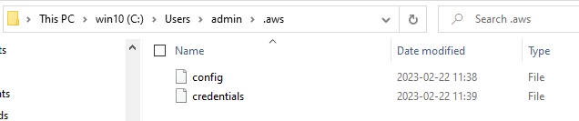

# test-json-aws-s3-v3

> Read `json` file from AWS S3 using **JS SDK v3**

```yml
GET http://localhost:8270/api/testjson/getdata
```

### **Postman Result is as below:**



### **AWS S3 Bucket is as below:**


### **Test JSON file to read is as below:**

```json
{
  "name": "zeply-btc-explorer",
  "version": "0.1.0",
  "private": true,
  "author": "Sheldon Thompson",
  "email": "sheldoontho@gmail.com",
  "main": "backend/server.js",
  "scripts": {
    "start": "node --max-old-space-size=4096 backend/server.js",
    "server": "nodemon --max-old-space-size=4096 backend/server.js",
    "client": "npm start --prefix frontend",
    "dev": "concurrently \"npm run server\" \"npm run client\"",
    "client:build": "npm run build --prefix frontend",
    "server:local": "npm run client:build && node --max-old-space-size=4096 backend/server_aws_zeply.js",
    "server:aws_zeply_dev": "pm2 start ecosystem.config.js --node-args=\"--max-old-space-size=4096\"",
    "server:aws_zeply_prod": "npm run client:build && pm2 start ecosystem.config.js --node-args=\"--max-old-space-size=8192\""
  },
  "devDependencies": {
    "concurrently": "^7.6.0",
    "nodemon": "^2.0.20",
    "pm2": "^5.2.2"
  },
  "license": "MIT"
}
```

---

### **AWS Credentials by Files**

> This is necessary for **AWS JavaScript SDK v3** integration.

- **`~/.aws/credentials`**
  ```yaml
  [default]
  aws_access_key_id=YOUR_AWS_ACCESS_KEY_ID
  aws_secret_access_key=YOUR_AWS_SECRET_ACCESS_KEY
  ```
- **`~/.aws/config`**
  ```yaml
  [default]
  aws_access_key_id=YOUR_AWS_ACCESS_KEY_ID
  aws_secret_access_key=YOUR_AWS_SECRET_ACCESS_KEY
  ```

For details, please refer [here](https://docs.aws.amazon.com/AWSJavaScriptSDK/v3/latest/modules/_aws_sdk_credential_providers.html#sample-files).

For **Win 10**, the path would be the following:

```path
C:\Users\[USERNAME]\.aws
```



For **Ubuntu 20.04** on AWS EC2, the path would be the following:

```path
/home/ubuntu/.aws
```


---

&copy; 2023 Sheldon T.

All Rights Reserved.
