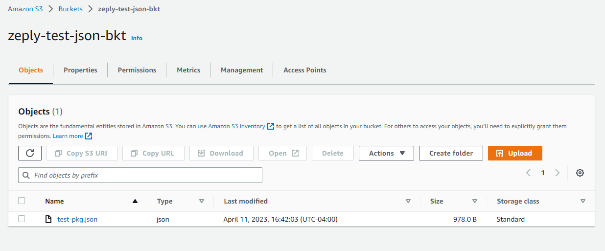

# test-json-aws-s3-v3

> Read `json` file from AWS S3 using **JS SDK v3**

### **Postman Result is as below:**


### **AWS S3 Bucket is as below:**



### **Test JSON file is as below:**

```json
{
  "name": "zeply-btc-explorer",
  "version": "0.1.0",
  "private": true,
  "author": "Sheldon Thompson",
  "email": "sheldoontho@gmail.com",
  "main": "backend/server.js",
  "scripts": {
    "start": "node --max-old-space-size=4096 backend/server.js",
    "server": "nodemon --max-old-space-size=4096 backend/server.js",
    "client": "npm start --prefix frontend",
    "dev": "concurrently \"npm run server\" \"npm run client\"",
    "client:build": "npm run build --prefix frontend",
    "server:local": "npm run client:build && node --max-old-space-size=4096 backend/server_aws_zeply.js",
    "server:aws_zeply_dev": "pm2 start ecosystem.config.js --node-args=\"--max-old-space-size=4096\"",
    "server:aws_zeply_prod": "npm run client:build && pm2 start ecosystem.config.js --node-args=\"--max-old-space-size=8192\""
  },
  "devDependencies": {
    "concurrently": "^7.6.0",
    "nodemon": "^2.0.20",
    "pm2": "^5.2.2"
  },
  "license": "MIT"
}
```

&copy; 2023 Sheldon T.

All Rights Reserved.
